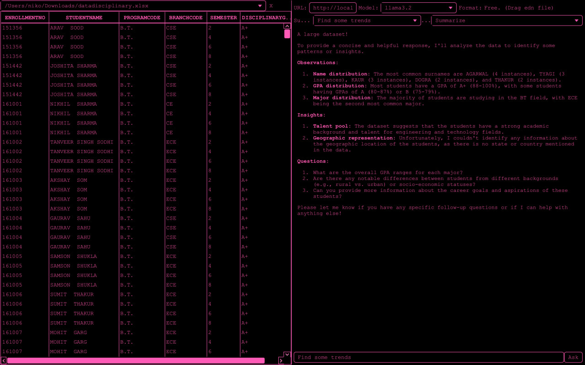

# Pink Terminal CSS for JavaFX

### Usage

```clojure
hellonico/origami-pink {
:git/url "https://github.com/hellonico/origami-pink.git"
;:local/root "../origami-pink/pink"
:deps/root "pink"
:git/sha "b157df1de3342b5dd7e694ecbbbe05db99bcc4c4"
}
```

### Output
